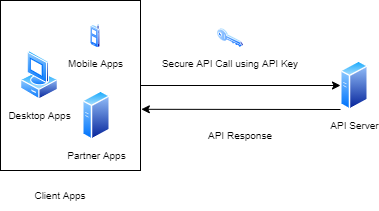

# Introduction

This repository was my learning project to achieve authentication using API Key authentication.

# Tech Stack

I used these tech stack for create this project with:
* Java 8
* [Spring Boot](https://spring.io/projects/spring-boot)

# Architecture

<div align='center'>



</div>

# Api Documentation

You can test our API using Postman. You can download the postman file [here](https://github.com/rizkyjayusman/cooperation/blob/main/docs/cooperation.postman_collection.json)

# Build and Run (Without Docker)

```
1. Clone the Project
   $ git clone git@github.com:rizkyjayusman/cooperation.git
   $ cd cooperation

2. Build and Package the Project
   $ mvn -e clean package

3. Run the Project
   $ java -jar /cooperation-project-path/app.jar
```

# Build and Run (With Docker)

```
1. Clone the Project
   $ git clone git@github.com:rizkyjayusman/cooperation.git
   $ cd cooperation

2. Build and Package the Project
   $ docker build -t alami-cooperation-app .
   $ docker-compose up -d --build
```
